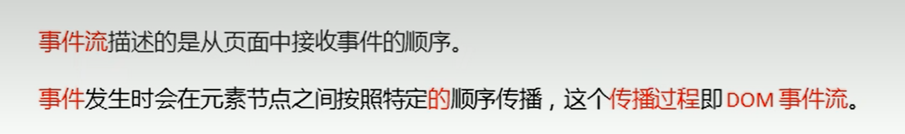
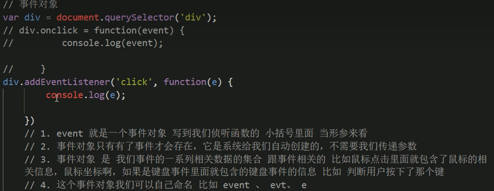
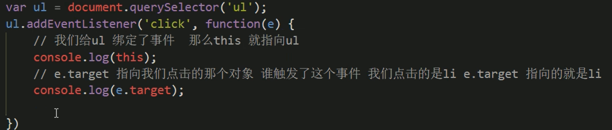

## 注册事件的两种方式

1. 传统 --- btn.onclick = function()
2. 最新 --- btn.addEventListener(type, listener, useCapture)
   type --- 'click', 'mouseover'等事件性字符串
   listener --- 事件处理函数
   useCapture --- true 对应 在捕获阶段操作 / false 对应在冒泡阶段操作 / 默认为false

## 删除事件的两种方式

1. 传统 --- btn.onclick = null;
2. 最新 --- btn.removeEventListener(type, listener)
   ```点一次就消失
   btn.addEventListener('click', fn)

   function fn() = {
     alert(!);
     btn.removeEventListener('click', fn);
   }
   ```

## DOM事件流的三个阶段

1. 
2. 三个阶段分别为：
   捕获: document -> html -> body -> div -> xxx
   当前: xxx -> target
   冒泡 target -> xxx -> div -> body -> html -> document

## 事件对象

1. 
2. event.target 和 this的区别:
   
3. 阻止默认事件：event.preventDefault();
4. 阻止冒泡：event.stopPropagation();

## 案例

## 事件委托原理

不给每个子节点单独设置事件监听器，而是在父节点上设置，然后利用冒泡原理来影响每个子节点

Eg: 一个ul下有很多li，点击li后，会冒泡到ul上，ul上有注册事件，所以会触发事件监听器 -> 只用了一次DOM，大幅提升效率

## 常见鼠标、键盘事件
